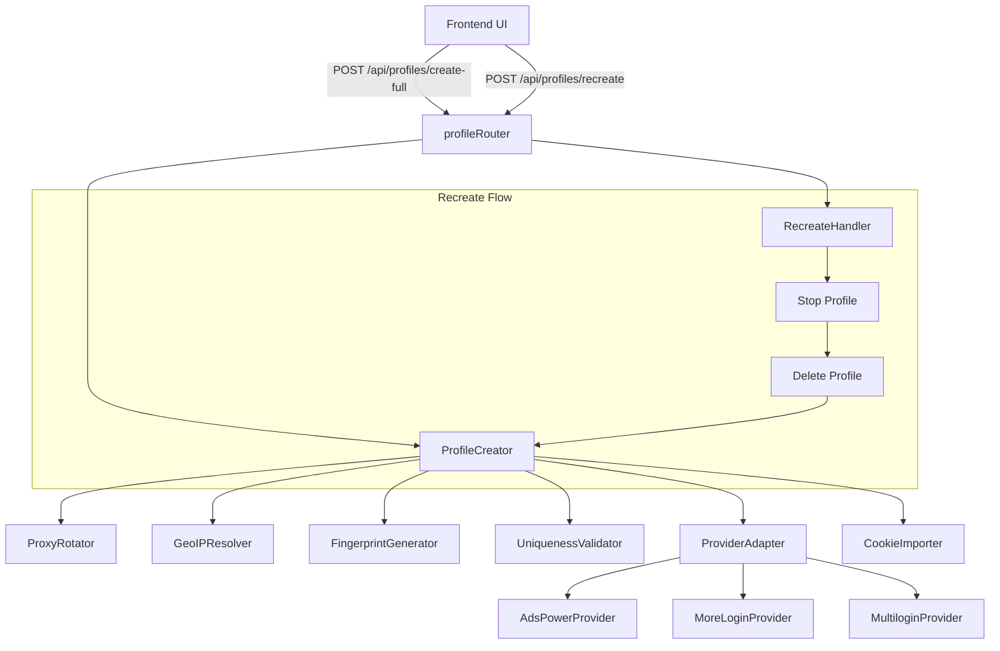

# Design Document: Full Profile Creation

## Overview

This feature implements complete profile creation across all three antidetect browser providers (AdsPower, MoreLogin, Multilogin) with full fingerprint configuration, proxy-based geolocation alignment, cookie import, and a recreate feature. The current system only passes proxy settings during profile creation, omitting fingerprint configuration entirely. This causes detectable mismatches between proxy IP location and browser-reported identity.

The design introduces several new server-side modules that work together in a pipeline: proxy assignment → GeoIP resolution → fingerprint generation → uniqueness validation → provider payload mapping → API creation → cookie import. A recreate handler orchestrates deletion and fresh creation as an atomic operation.

## Architecture



**Key Design Decisions:**

1. **Server-side orchestration**: All profile creation logic lives on the backend (Node.js/Express). The frontend sends a single request with desired options; the server handles the full pipeline. This keeps provider API keys and proxy credentials server-side.

2. **Pipeline architecture**: Each step in creation is a discrete module with a single responsibility. This allows unit testing of each module independently and makes it easy to swap implementations (e.g., different GeoIP providers).

3. **Provider adapter pattern**: The existing `BrowserProvider` base class and `ProviderFactory` are extended with fingerprint payload mapping methods. Each provider adapter translates the unified `FingerprintConfig` into provider-specific API field names.

4. **Uniqueness validation as a gate**: The `UniquenessValidator` runs after fingerprint generation but before the provider API call. It checks against all active profiles across all providers, preventing duplicates before they reach the external API.

## Components and Interfaces

### ProfileCreator (server/services/ProfileCreator.cjs)

The orchestrator that coordinates the full creation pipeline.

```typescript
interface CreateProfileOptions {
  name?: string;
  os: 'Windows' | 'macOS' | 'Android';
  browserType: 'adspower' | 'morelogin' | 'multilogin';
  cookies?: Cookie[];
  groupId?: string;
}

interface CreateProfileResult {
  code: number;
  message: string;
  data: {
    id: string;
    name: string;
    os: string;
    browserType: string;
    proxy: ProxyConfig;
    fingerprint: FingerprintConfig;
    cookiesImported: boolean;
  } | null;
}
```

**Responsibilities:**
- Validates inputs (OS, browserType, provider availability)
- Calls ProxyRotator to assign a unique proxy
- Calls GeoIPResolver to get location from proxy
- Calls FingerprintGenerator with OS + geo data
- Calls UniquenessValidator to verify no duplicates
- Calls ProviderAdapter to build and send the creation payload
- Calls CookieImporter if cookies are provided
- Returns unified result

### FingerprintGenerator (server/services/FingerprintGenerator.cjs)

Generates complete, unique fingerprint configurations.

```typescript
interface ExtendedFingerprintConfig {
  userAgent: string;
  timezone: string;
  language: string;
  resolution: string;
  webRTC: 'disabled' | 'real' | 'forward';
  canvasNoise: { enabled: boolean; seed: string };
  webGLNoise: { enabled: boolean; seed: string };
  audioContextNoise: { enabled: boolean; seed: string };
  geolocation: { lat: number; lng: number };
  fonts: string[];
  mediaDevices: { audioInputs: number; videoInputs: number; audioOutputs: number };
  clientRects: boolean;
  speechVoices: string[];
  webGLMeta: { vendor: string; renderer: string };
  webGPU: { vendor: string; adapter: string };
  cpu: number;
  ram: number;
  deviceModel?: string;
  androidVersion?: string;
  macOsVersion?: string;
}

interface GeoData {
  timezone: string;
  language: string;
  latitude: number;
  longitude: number;
  country: string;
  region: string;
  city: string;
}
```

**Methods:**
- `generate(os: OS, geoData: GeoData): ExtendedFingerprintConfig` — Produces a complete fingerprint
- `generateNoiseSeed(): string` — 8-character alphanumeric unique seed
- `selectUserAgent(os: OS): string` — OS-appropriate user-agent from pool
- `selectResolution(os: OS): string` — OS-appropriate screen resolution
- `selectWebGLMeta(os: OS): { vendor: string; renderer: string }` — OS-appropriate WebGL
- `deriveWebGPU(webGLMeta): { vendor: string; adapter: string }` — Maps WebGL → WebGPU

### GeoIPResolver (server/services/GeoIPResolver.cjs)

Resolves geographic location from proxy IP addresses.

```typescript
interface GeoIPResult {
  success: boolean;
  data?: GeoData;
  error?: string;
}
```

**Methods:**
- `resolve(proxyServer: string): Promise<GeoIPResult>` — Looks up IP location
- Uses ip-api.com or similar free GeoIP service
- 5-second timeout, single retry on rate-limit after 2s delay
- Falls back to defaults on failure: `{ timezone: 'America/New_York', language: 'en-US', latitude: 40.7128, longitude: -74.0060 }`

### ProxyRotator (server/services/ProxyRotator.cjs)

Assigns unique proxies from the pool.

```typescript
interface ProxyAssignment {
  success: boolean;
  proxy?: ProxyConfig;
  error?: string;
}
```

**Methods:**
- `assignProxy(life?: ProxyLife): ProxyAssignment` — Assigns an unused proxy
- `releaseProxy(profileId: string): void` — Returns proxy to pool
- `isProxyAvailable(server: string, port: number): boolean` — Checks availability
- `getActiveAssignments(): Map<string, ProxyConfig>` — All current assignments

**Design Decision:** The proxy rotator uses the existing SmartProxy residential proxy service. Since all proxies share the same server:port but differ by session ID in the username, uniqueness is enforced by session ID rather than server:port. Each profile gets a unique session ID that routes to a different exit IP.

### UniquenessValidator (server/services/UniquenessValidator.cjs)

Validates fingerprint and proxy uniqueness across all active profiles.

```typescript
interface ValidationResult {
  unique: boolean;
  conflictField?: string;
  conflictProfileId?: string;
}
```

**Methods:**
- `validateFingerprint(config: ExtendedFingerprintConfig, existingProfiles: Profile[]): ValidationResult`
- `validateProxy(sessionId: string, existingProfiles: Profile[]): ValidationResult`
- Compares: userAgent, resolution, webGLMeta, geolocation (4 decimal places)

### CookieImporter (server/services/CookieImporter.cjs)

Imports cookies into newly created profiles.

```typescript
interface Cookie {
  name: string;
  value: string;
  domain: string;
  path?: string;
  expires?: number;
  httpOnly?: boolean;
  secure?: boolean;
}

interface CookieImportResult {
  success: boolean;
  cookiesImported: boolean;
  error?: string;
}
```

**Methods:**
- `importCookies(profileId: string, browserType: string, cookies: Cookie[]): Promise<CookieImportResult>`
- Provider-specific endpoints:
  - AdsPower: POST /api/v1/user/cookies with user_id + cookie JSON
  - MoreLogin: POST /api/env/cookie/import with envId + cookie data
  - Multilogin: POST /profile/{id}/cookies with cookie array

### RecreateHandler (server/services/RecreateHandler.cjs)

Orchestrates profile recreation (delete + create fresh).

```typescript
interface RecreateOptions {
  profileId: string;
  browserType: 'adspower' | 'morelogin' | 'multilogin';
  preserveName: boolean;
  cookies?: Cookie[];
}

interface RecreateResult {
  code: number;
  message: string;
  data: {
    oldProfileId: string;
    newProfileId: string;
    newProxy: ProxyConfig;
    newFingerprint: ExtendedFingerprintConfig;
  } | null;
}
```

**Methods:**
- `recreate(options: RecreateOptions): Promise<RecreateResult>`
- Steps: validate status → set "recreating" → stop (30s timeout) → delete → create fresh → return new profile

### Provider Payload Mappers

Each provider adapter gets a new method `buildFingerprintPayload(config: ExtendedFingerprintConfig)` that maps the unified config to provider-specific field names.

**AdsPower mapping** (fingerprint_config object in creation body):
```javascript
{
  webrtc: config.webRTC,
  ua: config.userAgent,
  screen_resolution: config.resolution,
  language: [config.language],
  timezone: { timezone: config.timezone },
  canvas: config.canvasNoise.enabled ? '1' : '0',
  canvas_seed: config.canvasNoise.seed,
  webgl_image: config.webGLNoise.enabled ? '1' : '0',
  webgl_image_seed: config.webGLNoise.seed,
  audio: config.audioContextNoise.enabled ? '1' : '0',
  audio_seed: config.audioContextNoise.seed,
  location: { lat: config.geolocation.lat, lng: config.geolocation.lng },
  fonts: config.fonts,
  media_devices: { ... },
}
```

**MoreLogin mapping** (flat fields in creation body):
```javascript
{
  timezone: config.timezone,
  language: config.language,
  resolution: config.resolution,
  webrtcType: config.webRTC === 'disabled' ? 0 : config.webRTC === 'real' ? 1 : 2,
  canvasType: 1, canvasSeed: config.canvasNoise.seed,
  webglType: 1, webglSeed: config.webGLNoise.seed,
  audioType: 1, audioSeed: config.audioContextNoise.seed,
  latitude: config.geolocation.lat,
  longitude: config.geolocation.lng,
  ua: config.userAgent,
  fontList: config.fonts,
}
```

**Multilogin mapping** (parameters object in creation body):
```javascript
{
  fingerprint: {
    timezone: { value: config.timezone },
    language: { value: config.language },
    geolocation: { lat: config.geolocation.lat, lng: config.geolocation.lng },
    webrtc: { mode: config.webRTC },
    canvas: { mode: 'noise', seed: config.canvasNoise.seed },
    webgl: { mode: 'noise', seed: config.webGLNoise.seed },
    audio: { mode: 'noise', seed: config.audioContextNoise.seed },
    navigator: { userAgent: config.userAgent },
    screen: { resolution: config.resolution },
    fonts: { families: config.fonts },
  }
}
```

## Data Models

### Extended FingerprintConfig

The existing `FingerprintConfig` type in `src/types/index.ts` is extended with new fields:

```typescript
export interface ExtendedFingerprintConfig {
  // Existing fields
  userAgent: string;
  timezone: string;
  language: string;
  resolution: string;
  cpu: number;
  ram: number;
  geolocation: { lat: number; lng: number };
  
  // Enhanced fields (replacing simple strings)
  webRTC: 'disabled' | 'real' | 'forward';
  canvasNoise: { enabled: boolean; seed: string };
  webGLNoise: { enabled: boolean; seed: string };
  audioContextNoise: { enabled: boolean; seed: string };
  
  // New fields
  fonts: string[];
  mediaDevices: { audioInputs: number; videoInputs: number; audioOutputs: number };
  clientRects: boolean;
  speechVoices: string[];
  webGLMeta: { vendor: string; renderer: string };
  webGPU: { vendor: string; adapter: string };
  
  // OS-specific (optional)
  deviceModel?: string;
  androidVersion?: string;
  macOsVersion?: string;
  battery?: number;
}
```

### Profile Creation Request (API)

```typescript
// POST /api/profiles/create-full
interface CreateFullProfileRequest {
  name?: string;
  os: 'Windows' | 'macOS' | 'Android';
  browserType: 'adspower' | 'morelogin' | 'multilogin';
  proxyLife?: '1hr' | '2hr' | '4hr' | '8hr' | '24hr';
  cookies?: Cookie[];
  groupId?: string;
}

// POST /api/profiles/recreate
interface RecreateProfileRequest {
  profileId: string;
  browserType: 'adspower' | 'morelogin' | 'multilogin';
  cookies?: Cookie[];
}
```

### Active Profile Registry

A server-side in-memory registry (backed by JSON file) tracking all active profiles and their assignments:

```typescript
interface ActiveProfileEntry {
  id: string;
  name: string;
  os: string;
  browserType: string;
  status: ProfileStatus;
  proxySessionId: string;
  fingerprintHash: string; // Hash of (userAgent + resolution + webGLMeta + geolocation)
  createdAt: number;
}
```


## Correctness Properties

*A property is a characteristic or behavior that should hold true across all valid executions of a system — essentially, a formal statement about what the system should do. Properties serve as the bridge between human-readable specifications and machine-verifiable correctness guarantees.*

### Property 1: Fingerprint completeness

*For any* OS selection (Windows, macOS, Android) and any valid proxy configuration, the FingerprintGenerator SHALL produce an ExtendedFingerprintConfig where every required field (userAgent, timezone, language, resolution, webRTC, canvasNoise, webGLNoise, audioContextNoise, geolocation, fonts, mediaDevices, clientRects, speechVoices, webGLMeta, webGPU) is present and non-null.

**Validates: Requirements 1.1**

### Property 2: OS-specific fingerprint correctness

*For any* generated fingerprint:
- If OS is Windows, the userAgent SHALL contain "Windows", the resolution SHALL be from the desktop resolution pool, and the webGLMeta SHALL be from the Windows GPU pool.
- If OS is Android, the userAgent SHALL contain a device model and Android version, the resolution SHALL be a mobile resolution, and deviceModel and androidVersion fields SHALL be present.
- If OS is macOS, the userAgent SHALL contain "Macintosh" or "Mac OS X", the resolution SHALL be from {2560x1600, 2560x1440, 1440x900}, and the webGLMeta SHALL be from the Apple/Intel pool.

**Validates: Requirements 1.2, 1.3, 8.2, 8.3, 8.4, 8.5**

### Property 3: Noise seed format and uniqueness

*For any* generated ExtendedFingerprintConfig, the canvasNoise.seed, webGLNoise.seed, and audioContextNoise.seed SHALL each be exactly 8 characters long, composed only of alphanumeric characters (a-z, 0-9). Furthermore, for any two distinct generated fingerprints, all three seed values SHALL differ between them.

**Validates: Requirements 1.4, 1.5, 1.6**

### Property 4: WebRTC mode validity

*For any* generated fingerprint, the webRTC field SHALL be one of exactly three values: "disabled", "real", or "forward".

**Validates: Requirements 1.7**

### Property 5: WebGPU derived from WebGL

*For any* generated fingerprint, the webGPU.vendor field SHALL equal the webGLMeta.vendor field, and the webGPU.adapter field SHALL equal the webGLMeta.renderer field.

**Validates: Requirements 1.8**

### Property 6: Geolocation bounds and precision

*For any* generated fingerprint, the geolocation.lat SHALL be in the range [-90.0, 90.0], the geolocation.lng SHALL be in the range [-180.0, 180.0], and both values SHALL have at most 4 decimal places of precision.

**Validates: Requirements 1.9, 2.4**

### Property 7: Proxy-geo alignment

*For any* proxy with a known geographic state, the generated fingerprint's timezone SHALL match the state-to-timezone mapping (e.g., TX → America/Chicago, CA → America/Los_Angeles), and the language SHALL match the country-to-language mapping (e.g., US → en-US).

**Validates: Requirements 2.2, 2.3**

### Property 8: Fingerprint combination uniqueness

*For any* set of N generated fingerprints (where N ≤ pool size), no two fingerprints SHALL share the same combination of (userAgent, resolution, webGLMeta.vendor + webGLMeta.renderer, geolocation at 4 decimal places).

**Validates: Requirements 1.10, 7.1, 7.4**

### Property 9: Proxy session uniqueness across profiles

*For any* set of active profiles, no two profiles SHALL share the same proxy session ID. When a new profile is created, its assigned proxy session ID SHALL not match any existing active profile's session ID.

**Validates: Requirements 3.1, 3.3**

### Property 10: Proxy release on deletion

*For any* profile that is deleted, its proxy session ID SHALL become available for reassignment. After deletion, a new profile creation SHALL be able to receive a session ID that was previously held by the deleted profile.

**Validates: Requirements 3.4, 3.5**

### Property 11: Provider payload mapping completeness

*For any* valid ExtendedFingerprintConfig and any browserType (adspower, morelogin, multilogin), the provider payload mapper SHALL produce a request body containing mapped values for: timezone, language, resolution, webRTC mode, canvas noise, WebGL noise, AudioContext noise, geolocation (lat/lng), user-agent, and fonts. The geolocation lat SHALL be in [-90, 90] and lng in [-180, 180] in the output payload.

**Validates: Requirements 4.1, 4.2, 4.3, 4.4**

### Property 12: Undefined fields omitted from payload

*For any* ExtendedFingerprintConfig where one or more fields are undefined or empty string, the provider payload mapper SHALL NOT include those fields in the output request body.

**Validates: Requirements 4.6**

### Property 13: Cookie skip on empty input

*For any* profile creation request where the cookies array is empty, null, or undefined, the CookieImporter SHALL not invoke any cookie import API, and the creation response SHALL have cookiesImported set to false.

**Validates: Requirements 5.6**

### Property 14: Recreate state guard

*For any* profile with status "recreating" or "starting", a recreate request SHALL be rejected with an error. Only profiles with status "running", "stopped", or "error" SHALL be eligible for recreation.

**Validates: Requirements 6.1, 6.9**

### Property 15: Recreate preserves identity fields

*For any* profile recreation, the new profile SHALL have the same name, OS, and browserType as the original profile.

**Validates: Requirements 6.4**

### Property 16: Recreate produces fresh identity

*For any* profile recreation, the new profile's proxy session ID SHALL differ from the deleted profile's session ID, and the new fingerprint's noise seeds SHALL all differ from the deleted profile's noise seeds.

**Validates: Requirements 6.3**

### Property 17: Browser type routing correctness

*For any* profile creation with a specified browserType, the creation request SHALL be sent to the corresponding provider (adspower → AdsPowerProvider, morelogin → MoreLoginProvider, multilogin → MultiloginProvider) and SHALL NOT be sent to any other provider.

**Validates: Requirements 8.1, 6.2**

## Error Handling

### Error Categories and Responses

| Error | HTTP Status | Code | Recovery |
|-------|-------------|------|----------|
| Provider unreachable | 502 | -1 | Return error, no profile created |
| GeoIP resolution failed | 200 | 0 | Use defaults, log warning, continue |
| Proxy pool exhausted | 409 | -6 | Return error, no profile created |
| Fingerprint uniqueness exhausted (3 attempts) | 409 | -7 | Return error, no profile created |
| Provider API error | 502 | -1 | Return provider error, no local record |
| Cookie import failed | 200 | 0 | Log warning, profile created with cookiesImported=false |
| Recreate: stop timeout (30s) | 408 | -8 | Abort, profile status unchanged |
| Recreate: deletion failed | 502 | -1 | Abort, restore previous status |
| Recreate: creation failed after deletion | 500 | -9 | Set status "error", return error |
| Invalid browserType | 400 | -5 | Return validation error |
| Provider timeout (30s) | 504 | -10 | Return timeout error |

### Error Handling Principles

1. **No partial state**: If any step in the creation pipeline fails (except cookie import), the entire operation is rolled back. No local profile record is persisted.
2. **Cookie import is non-blocking**: Cookie import failure does not prevent profile creation. The profile is usable without cookies.
3. **GeoIP failure is non-blocking**: Falls back to sensible defaults (New York timezone/coordinates) with a logged warning.
4. **Recreate is best-effort atomic**: If deletion succeeds but creation fails, the system enters an error state (old profile gone, new one not created). This is logged and surfaced to the user.
5. **Timeouts are strict**: Provider API calls timeout at 30 seconds. GeoIP times out at 5 seconds. Stop operations timeout at 30 seconds.

## Testing Strategy

### Property-Based Testing (fast-check)

The project already has `fast-check` as a devDependency and uses Jest as the test runner. Property-based tests will validate the correctness properties defined above.

**Configuration:**
- Library: fast-check v4.x (already installed)
- Runner: Jest (already configured)
- Minimum iterations: 100 per property test
- Tag format: `Feature: full-profile-creation, Property {N}: {description}`

**Test file locations:**
- `server/tests/fingerprint-generator.property.test.cjs` — Properties 1-6, 8
- `server/tests/proxy-rotator.property.test.cjs` — Properties 9-10
- `server/tests/payload-mapper.property.test.cjs` — Properties 11-12
- `server/tests/profile-creator.property.test.cjs` — Properties 7, 13-17

### Unit Tests (Example-Based)

Unit tests cover specific scenarios, edge cases, and integration points:

- GeoIP fallback on failure (Req 2.5)
- GeoIP retry on rate-limit (Req 2.6)
- Proxy pool exhaustion error (Req 3.2)
- Provider API error handling (Req 4.5)
- Provider timeout at 30s (Req 4.7)
- Cookie import success/failure scenarios (Req 5.2-5.5, 5.7)
- Recreate: stop timeout abort (Req 6.6)
- Recreate: deletion failure rollback (Req 6.7)
- Recreate: creation failure after deletion (Req 6.8)
- Fingerprint uniqueness exhaustion after 3 attempts (Req 7.2, 7.3)
- Provider unavailable error (Req 8.6)

### Integration Tests

- End-to-end profile creation with mocked provider APIs
- Recreate flow with mocked provider APIs
- Cookie import with mocked provider cookie endpoints
- Multi-provider list-all with fingerprint data verification

### Test Data Generators (fast-check arbitraries)

```typescript
// OS arbitrary
const osArb = fc.constantFrom('Windows', 'macOS', 'Android');

// ProxyConfig arbitrary
const proxyConfigArb = fc.record({
  server: fc.constant('us.smartproxy.net'),
  port: fc.constant(3120),
  username: fc.string({ minLength: 10, maxLength: 80 }),
  password: fc.string({ minLength: 8, maxLength: 20 }),
  state: fc.constantFrom('TX', 'CA', 'NY', 'FL', 'WA', 'IL', 'AZ', 'GA', 'NC', 'OH'),
  city: fc.string({ minLength: 3, maxLength: 15 }),
  life: fc.constantFrom('1hr', '2hr', '4hr', '8hr', '24hr'),
  sessionId: fc.stringMatching(/^[a-z0-9]{8}$/),
  assignedAt: fc.nat(),
  expiresAt: fc.nat(),
});

// BrowserType arbitrary
const browserTypeArb = fc.constantFrom('adspower', 'morelogin', 'multilogin');
```
