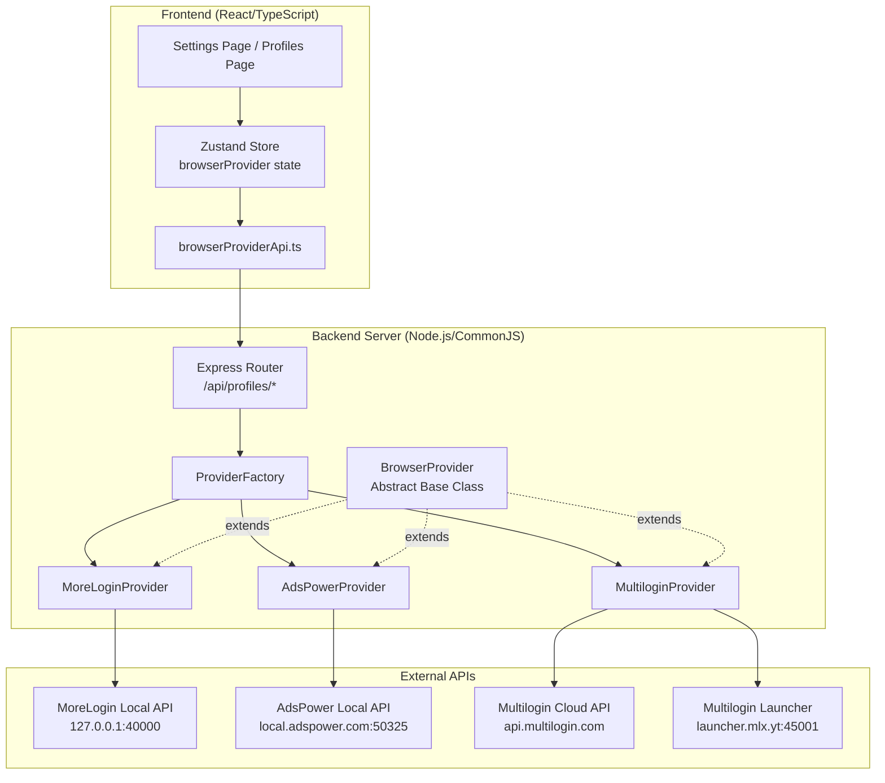
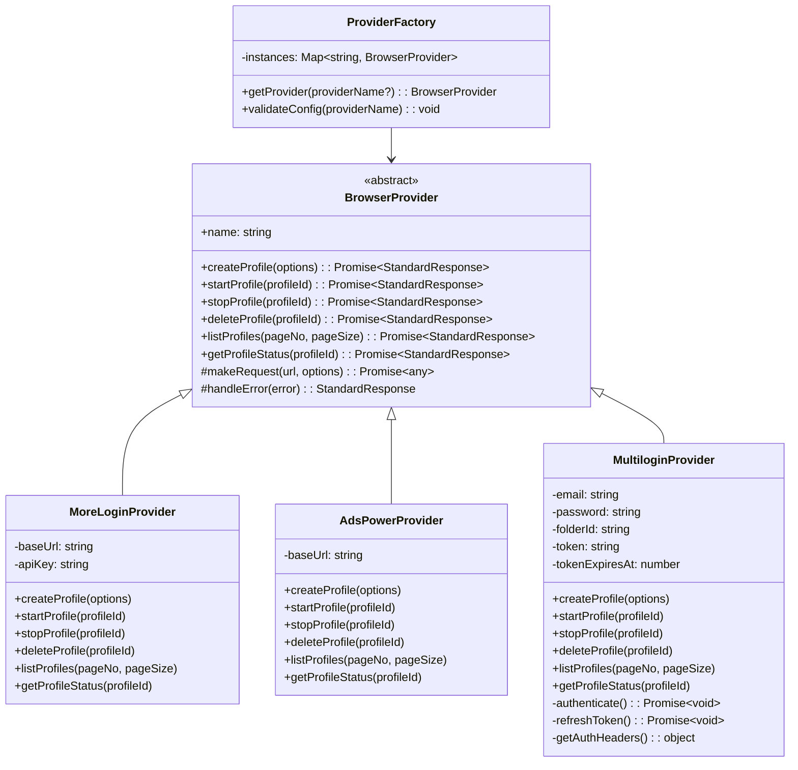
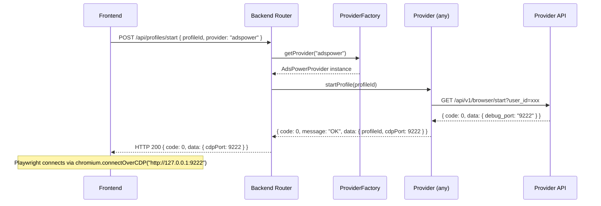
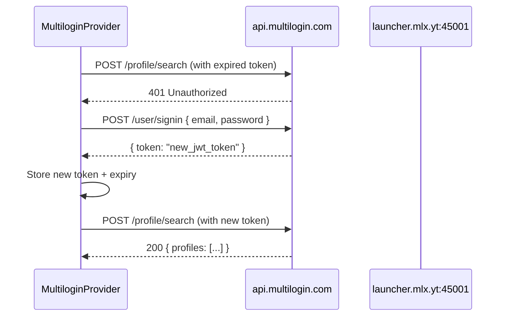
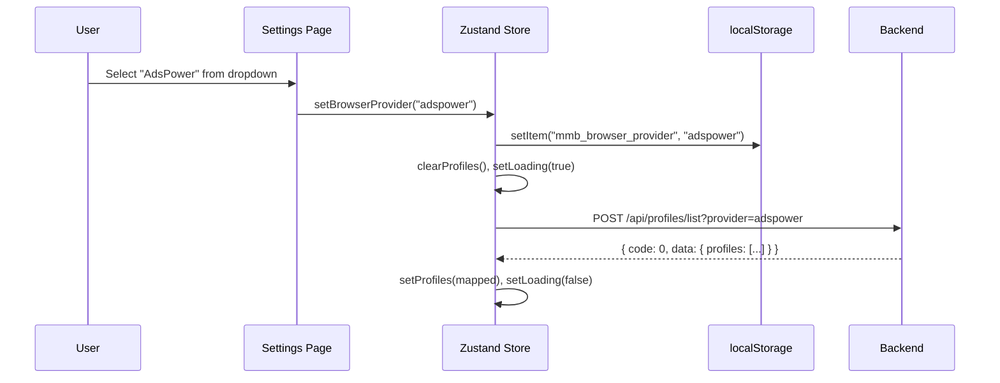
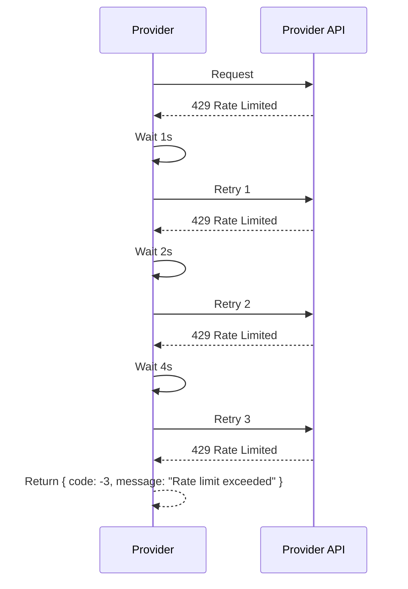

# Design Document: Multi-Browser Support

## Overview

This design introduces a **Provider Pattern** architecture to support AdsPower and Multilogin antidetect browsers alongside the existing MoreLogin integration. The core idea is an abstract `BrowserProvider` base class that defines a unified interface, with concrete implementations for each browser. A `ProviderFactory` instantiates the correct provider based on configuration.

The architecture ensures:
- **Backward compatibility**: Existing MoreLogin code continues to work unchanged
- **Extensibility**: New browsers can be added by implementing the base class
- **Unified CDP connection**: All providers return a `cdpPort` for Playwright's `chromium.connectOverCDP()`
- **Shared across sub-projects**: Both the main YouTube app (`server/`) and MMB AGENT SITES (`MMB AGENT SITES/server/`) use the same provider modules

### Key Design Decisions

1. **CommonJS modules** (.cjs) — matches existing server code style
2. **Class-based inheritance** — `BrowserProvider` base class with method stubs that throw if not implemented
3. **Factory pattern** — single entry point for provider instantiation
4. **Standardized response objects** — every provider method returns `{ code, message, data }`
5. **Environment-driven configuration** — provider selection and credentials via `.env`
6. **Frontend provider switching** — Zustand store + localStorage persistence for UI-driven provider selection

## Architecture

### High-Level Component Diagram



### Class Hierarchy



## Components and Interfaces

### 1. BrowserProvider Base Class (`server/providers/BrowserProvider.cjs`)

The abstract base class that all providers extend. Provides shared utilities for HTTP requests, error handling, and retry logic.

```javascript
class BrowserProvider {
  constructor(name) {
    this.name = name;
  }

  // Abstract methods — must be overridden
  async createProfile(options) { throw new Error('Not implemented'); }
  async startProfile(profileId) { throw new Error('Not implemented'); }
  async stopProfile(profileId) { throw new Error('Not implemented'); }
  async deleteProfile(profileId) { throw new Error('Not implemented'); }
  async listProfiles(pageNo = 1, pageSize = 50) { throw new Error('Not implemented'); }
  async getProfileStatus(profileId) { throw new Error('Not implemented'); }

  // Shared utilities
  makeRequest(url, options) { /* HTTP with timeout + retry */ }
  handleError(error) { /* Maps errors to standardized codes */ }
  validateProxy(proxy) { /* Validates proxy object before API call */ }
}
```

### 2. ProviderFactory (`server/providers/ProviderFactory.cjs`)

Singleton factory that caches provider instances and validates configuration at startup.

```javascript
class ProviderFactory {
  constructor() {
    this.instances = new Map();
  }

  getProvider(providerName) {
    // Resolve provider name: param > env var > default "morelogin"
    const name = providerName || process.env.BROWSER_PROVIDER || 'morelogin';
    // Validate
    if (!['morelogin', 'adspower', 'multilogin'].includes(name)) {
      throw new Error(`Invalid provider "${name}". Accepted: morelogin, adspower, multilogin`);
    }
    // Return cached or create new
    if (!this.instances.has(name)) {
      this.instances.set(name, this._createProvider(name));
    }
    return this.instances.get(name);
  }

  validateConfig(providerName) {
    // Check required env vars for the provider
    // Throws descriptive error if missing
  }
}
```

### 3. Provider Implementations

#### MoreLoginProvider (`server/providers/MoreLoginProvider.cjs`)
- Wraps existing `moreloginRequest()` function
- Maps MoreLogin response format (`code`, `msg`, `data`) to standardized format
- No changes to existing API call logic

#### AdsPowerProvider (`server/providers/AdsPowerProvider.cjs`)
- Connects to AdsPower Local API (default: `http://local.adspower.com:50325`)
- Maps AdsPower field names (`user_id` → `id`, `debug_port` → `cdpPort`)
- Uses GET requests for start/stop (per AdsPower API design)

#### MultiloginProvider (`server/providers/MultiloginProvider.cjs`)
- Manages Bearer token lifecycle (30-min expiry, auto-refresh on 401)
- Split between cloud API (`api.multilogin.com`) and local launcher (`launcher.mlx.yt:45001`)
- Uses `automation_type=playwright` for start requests
- Requires `folder_id` for profile organization

### 4. Server Router (`server/providers/profileRouter.cjs`)

Express router that handles `/api/profiles/*` endpoints and delegates to the factory.

```javascript
const router = express.Router();

router.post('/list', async (req, res) => {
  const provider = factory.getProvider(req.query.provider);
  const result = await provider.listProfiles(req.body.pageNo, req.body.pageSize);
  res.status(result.code === 0 ? 200 : 502).json(result);
});

// Similar for /create, /start, /stop, /delete
```

### 5. Frontend API Service (`src/services/browserProviderApi.ts`)

TypeScript service that calls the backend profile endpoints with the selected provider.

### 6. Frontend Store Updates

The existing Zustand stores in both apps get a `browserProvider` field and updated fetch/action methods that pass the provider parameter.

## Data Models

### StandardResponse

```typescript
interface StandardResponse<T = any> {
  code: number;       // 0 = success, negative = error
  message: string;    // Human-readable (max 256 chars)
  data: T | null;     // Payload on success, null on failure
}
```

### Error Codes

| Code | Meaning |
|------|---------|
| 0 | Success |
| -1 | Connection error / timeout (provider app not running) |
| -2 | Authentication error (invalid credentials) |
| -3 | Rate limit exceeded (all retries exhausted) |
| -4 | Token refresh failed (Multilogin re-auth required) |
| -5 | Validation error (invalid input parameters) |
| >0 | Provider-specific error (passed through from provider API) |

### StandardProfile

```typescript
interface StandardProfile {
  id: string;
  name: string;
  status: 'running' | 'stopped' | 'error' | 'unknown';
  debugPort: number | null;   // CDP port, null when not running
  browserType: 'morelogin' | 'adspower' | 'multilogin';
}
```

### CreateProfileOptions

```typescript
interface CreateProfileOptions {
  name?: string;
  os?: 'windows' | 'macos' | 'android';
  proxy?: ProxyConfig | null;   // null = direct connection
  browserType?: 'chrome' | 'firefox';
}
```

### ProxyConfig

```typescript
interface ProxyConfig {
  server: string;       // 1-253 chars
  port: number;         // 1-65535
  username?: string;    // 0-255 chars
  password?: string;    // 0-255 chars
  protocol: 'http' | 'socks5';
}
```

### StartProfileResponse (data field)

```typescript
interface StartProfileData {
  profileId: string;
  cdpPort: number;      // 1024-65535, for chromium.connectOverCDP()
}
```

### Proxy Mapping Per Provider

| Standard Field | MoreLogin | AdsPower | Multilogin |
|---|---|---|---|
| server | proxyIp | proxy_host | host |
| port | proxyPort | proxy_port | port |
| username | username | proxy_user | username |
| password | password | proxy_password | password |
| protocol | proxyType | proxy_soft + proxy_type | type |

## Sequence Diagrams

### Start Profile Flow



### Multilogin Token Refresh Flow



### Provider Selection Flow (Frontend)



### Error Handling with Retry Flow



## File Structure

```
server/
├── providers/
│   ├── BrowserProvider.cjs        # Abstract base class
│   ├── MoreLoginProvider.cjs      # MoreLogin implementation (wraps existing)
│   ├── AdsPowerProvider.cjs       # AdsPower implementation
│   ├── MultiloginProvider.cjs     # Multilogin implementation
│   ├── ProviderFactory.cjs        # Factory + config validation
│   └── profileRouter.cjs          # Express router for /api/profiles/*
├── test-browsers.cjs              # Integration test script
├── index.cjs                      # (existing — add router mount)
├── agent.cjs                      # (existing — use provider for CDP port)
├── orchestrator.cjs               # (existing)
├── searchEngine.cjs               # (existing)
└── worker.cjs                     # (existing)

src/
├── services/
│   ├── browserProviderApi.ts      # New unified provider API service
│   ├── moreloginApi.ts            # (existing — kept for backward compat)
│   └── ...
├── store/
│   └── useStore.ts                # (updated — add browserProvider state)
├── components/
│   ├── SettingsPage.tsx            # (updated — add provider dropdown)
│   ├── ProfilesPage.tsx           # (updated — show active provider)
│   └── ...
└── types/
    └── index.ts                   # (updated — add provider types)

MMB AGENT SITES/
├── server/
│   └── index.cjs                  # (updated — mount profileRouter)
├── src/
│   ├── services/
│   │   └── browserProviderApi.ts  # Shared or duplicated provider API
│   ├── store/
│   │   └── useStore.ts            # (updated — add browserProvider)
│   └── components/
│       └── SettingsPage.tsx        # (updated — add provider dropdown)
└── ...
```

## Correctness Properties

*A property is a characteristic or behavior that should hold true across all valid executions of a system — essentially, a formal statement about what the system should do. Properties serve as the bridge between human-readable specifications and machine-verifiable correctness guarantees.*

### Property 1: Response Structure Invariant

*For any* Browser_Provider implementation and *for any* method call (createProfile, startProfile, stopProfile, deleteProfile, listProfiles, getProfileStatus), the returned object SHALL contain a `code` field (number), a `message` field (string with length ≤ 256), and a `data` field (object when code is 0, null when code is non-zero). Additionally, any profile object within the data SHALL contain `id` (string), `name` (string), `status` (one of "running", "stopped", "error", "unknown"), `debugPort` (number or null), and `browserType` (one of "morelogin", "adspower", "multilogin").

**Validates: Requirements 1.2, 1.3**

### Property 2: CDP Port Range Invariant

*For any* successful startProfile call (code === 0) on *any* provider, the `data.cdpPort` value SHALL be an integer between 1024 and 65535 inclusive.

**Validates: Requirements 1.4**

### Property 3: Factory Routing Correctness

*For any* valid provider identifier ("morelogin", "adspower", "multilogin"), the ProviderFactory SHALL return an instance of the corresponding provider class. For any invalid or empty identifier with no BROWSER_PROVIDER environment variable set, the factory SHALL return a MoreLoginProvider instance.

**Validates: Requirements 1.6, 1.7, 7.1**

### Property 4: MoreLogin Passthrough Equivalence

*For any* method call on MoreLogin_Provider with *any* valid parameters, the underlying `moreloginRequest` function SHALL receive identical endpoint paths and request bodies as the current direct implementation, and the response SHALL be correctly mapped from MoreLogin format (code→code, msg→message, data fields→StandardProfile fields).

**Validates: Requirements 4.1, 4.3, 4.4**

### Property 5: Proxy Mapping Correctness

*For any* valid proxy configuration (server, port, username, password, protocol) and *for any* provider, calling createProfile SHALL map the proxy fields to the provider-specific format: MoreLogin (proxyIp, proxyPort, username, password, proxyType), AdsPower (proxy_host, proxy_port, proxy_user, proxy_password, proxy_soft), Multilogin (host, port, username, password, type).

**Validates: Requirements 10.1, 10.2, 10.4**

### Property 6: Proxy Validation Guard

*For any* proxy object that is missing the `server` field or the `port` field, calling createProfile on *any* provider SHALL return an error response (code -5) indicating which required fields are absent, WITHOUT making any HTTP request to the provider API.

**Validates: Requirements 10.5**

### Property 7: Error Code Assignment

*For any* provider and *for any* network failure (connection refused, timeout exceeding 10 seconds), the response SHALL have code -1. *For any* authentication error response from a provider API, the response SHALL have code -2.

**Validates: Requirements 8.1, 8.2**

### Property 8: Rate Limit Retry with Exponential Backoff

*For any* provider API request that receives a rate limit error, the system SHALL retry exactly 3 times with delays of 1 second, 2 seconds, and 4 seconds respectively. If all retries are exhausted, the response SHALL have code -3.

**Validates: Requirements 8.3, 8.4**

### Property 9: Multilogin Token Refresh on 401

*For any* Multilogin API request that receives a 401 authentication error, the provider SHALL attempt to refresh the token by calling the signin endpoint exactly once, then retry the original request. If the refresh itself fails, the response SHALL have code -4.

**Validates: Requirements 3.6, 8.6**

### Property 10: Configuration Validation

*For any* BROWSER_PROVIDER value that is not one of "morelogin", "adspower", or "multilogin", the ProviderFactory SHALL throw an error listing the accepted values. *For any* selected provider with a missing or empty required environment variable, the factory SHALL throw an error that includes both the variable name and the provider name.

**Validates: Requirements 5.3, 5.5, 5.6, 5.7**

### Property 11: Frontend Provider State Persistence

*For any* valid provider value selected by the user, the Zustand store SHALL update the `browserProvider` state AND persist the value to localStorage under key "mmb_browser_provider". On application initialization, the store SHALL read the persisted value and use it as the active provider.

**Validates: Requirements 6.2, 6.7**

### Property 12: Frontend Fetch Routing on Provider Change

*For any* browser provider change in the frontend store, the system SHALL (in order): clear the current profiles list, set loading to true, and call fetchProfiles with the new provider parameter. The API request SHALL include the selected provider as a query parameter.

**Validates: Requirements 6.3, 6.5**

## Error Handling

### Strategy

Error handling follows a **layered approach**:

1. **Provider Layer** — Each provider catches API-specific errors and maps them to standardized error codes
2. **Base Class Layer** — `BrowserProvider.handleError()` provides shared error classification (timeout → -1, auth → -2, rate limit → -3)
3. **Router Layer** — Express router maps error codes to HTTP status codes (0 → 200, negative → 502, validation → 400)
4. **Frontend Layer** — Store catches HTTP errors and displays user-friendly messages via the log system

### Retry Logic (in Base Class)

```javascript
async makeRequest(url, options, retryConfig = { maxRetries: 3, baseDelay: 1000 }) {
  for (let attempt = 0; attempt <= retryConfig.maxRetries; attempt++) {
    try {
      const response = await this._httpRequest(url, options);
      if (response.statusCode === 429 && attempt < retryConfig.maxRetries) {
        const delay = retryConfig.baseDelay * Math.pow(2, attempt); // 1s, 2s, 4s
        await this._sleep(delay);
        continue;
      }
      return response;
    } catch (error) {
      if (attempt === retryConfig.maxRetries) throw error;
      if (error.code === 'ECONNREFUSED' || error.code === 'ETIMEDOUT') throw error; // Don't retry connection errors
    }
  }
}
```

### Timeout Configuration

| Provider | Connect Timeout | Request Timeout | Start Profile Timeout |
|---|---|---|---|
| MoreLogin | 5s | 10s | 60s |
| AdsPower | 5s | 10s | 30s |
| Multilogin | 5s | 10s | 30s |

### Logging Format

Every operation is logged to the server console:

```
[2025-01-15T10:30:45.123Z] [adspower] [start] profile=abc123 result=success cdpPort=9222
[2025-01-15T10:30:46.456Z] [multilogin] [list] result=error message="Token expired, refreshing..."
```

## Testing Strategy

### Unit Tests (Example-Based)

- Factory returns correct provider for each valid input
- Factory throws on invalid provider names
- Each provider correctly maps its API response to StandardResponse
- Proxy validation rejects missing server/port
- MoreLogin wrapper produces identical API calls to current implementation
- Frontend store initializes with persisted provider from localStorage
- Settings page renders provider dropdown with all options

### Property-Based Tests

Property-based testing is appropriate for this feature because:
- The provider interface has universal properties that must hold across all implementations
- Input spaces (proxy configs, profile IDs, error types) are large
- Field mapping logic has many edge cases that random generation can catch

**Library**: [fast-check](https://github.com/dubzzz/fast-check) (JavaScript/TypeScript PBT library)

**Configuration**:
- Minimum 100 iterations per property test
- Each test tagged with: `Feature: multi-browser-support, Property {N}: {title}`

**Properties to implement**:
1. Response structure invariant (Property 1)
2. CDP port range invariant (Property 2)
3. Factory routing correctness (Property 3)
4. MoreLogin passthrough equivalence (Property 4)
5. Proxy mapping correctness (Property 5)
6. Proxy validation guard (Property 6)
7. Error code assignment (Property 7)
8. Rate limit retry with backoff (Property 8)
9. Token refresh on 401 (Property 9)
10. Configuration validation (Property 10)
11. Frontend provider state persistence (Property 11)
12. Frontend fetch routing (Property 12)

### Integration Tests (`server/test-browsers.cjs`)

A single-command test script that validates the full flow against real provider APIs:
- Sequential: list → create → start → verify CDP_Port → stop → delete
- Skips unconfigured providers with clear messages
- 30-second timeout per operation
- Cleanup: always attempts to delete created profiles
- Summary table output with pass/fail/skipped per operation
- Exit code: 0 (all pass) or 1 (any fail)

### Test Execution

```bash
# Unit + Property tests
npx vitest --run

# Integration test (requires running provider apps)
node server/test-browsers.cjs
```
